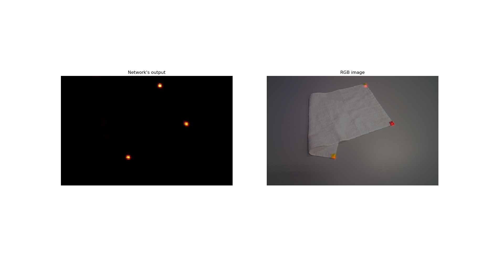
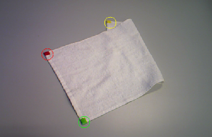

# Real-time display and image capture (Python2.7)
This repo contains the code structure to display in real-time (a depth camera is needed) the output of a  designed to detect the corners of a wrinkled towel. It also contains a script to capture images (with their respective annotations) to create a dataset for the aforementioned network.

## Installation

**Clone and install requirements**  
```
$ git clone https://github.com/AlbertMitjans/real-time.git
$ cd real-time
$ ???
```

**Download pre-trained weights**
```
$ cd checkpoints
$ bash get_weights.sh
```

**Connect camera**  
Connect an Asus XtionPRO LIVE camera and launch it as follows:
```
$ roslaunch openni2_launch openni2.launch depth_registration:=true
```

## Real-time display
```
$ python2 realtime_display.py --ckpt1 CKPT1 --ckpt2 CKPT2 --compare TRUE/FALSE
```
Press "s" to save an image.  
Press "q" to quit.

<p align="center">
  
</p>

**Arguments**  
--ckpt1 (default="checkpoints/ckpt.pth") : path to checkpoint/model file.  
--ckpt2 (default="checkpoints/ckpt_2.pth") : path to checkpoint/model file (only used when compare=True).  
--compare (default=False) : if True the outputs of ckpt1 and ckpt2 will be displayed.  

## Image capture
This script can be used to generate depth images of wrinkled cloths and annotate the position of their respective corners (non visible corners will be given a value of -1). To do so, each corner of the cloth must be marked with one of this colors (without repeting any): red, green, blue and yellow. The script will use color segmentation to measure each corner's coordinates.
```
$ python2 capture_images.py --path PATH
```
Press "c" to capture an image.  
Press "e" to exit.  
Press "r" to repeat (it will overwrite the last captured image).  
Insert an integer to jump to another position of the dataset.  

When capturing, the following files will be saved in the given path:  
+ image0_rgb.png : A PNG file with the RGB image (in uint8).  
+ image0_depth.png : A PNG file with the depth image (in float32).  
+ image0.csv : A CSV file with the center coordinates of the red/green/yellow/blue colors in the image.  
+ image0.pcd : A PCD file with the pointcloud of the image.  

Also, an RGB image with colored circles on the detected "corners" will be displayed for 3 seconds in order for you to see if the detection was succesfull. You can change the time of the display with the argument display_time.  

<p align="center">
  
</p>

The script will always start from 0 (CAREFUL, if you already have the image0 files, it will overwrite them!).
To start counting from another number, you just have to write the number in the terminal/console. 

**Arguments**  
--path (default=None) : path to folder.  
--ros_master_uri (default=http://<span></span>192.168.102.15:11311) : connection to raspberry pi.  
--display_time (default=3) : time of the display (in seconds) of the RGB image with the colored circles.
